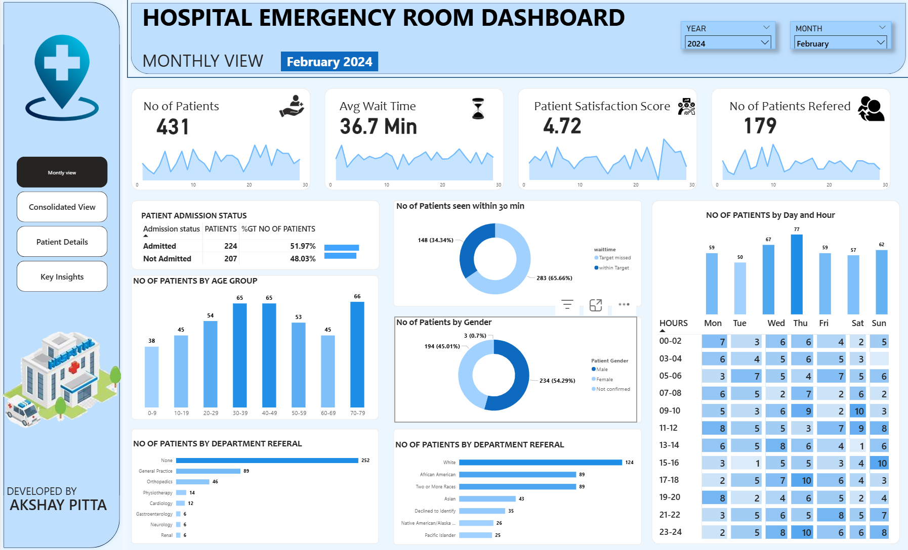
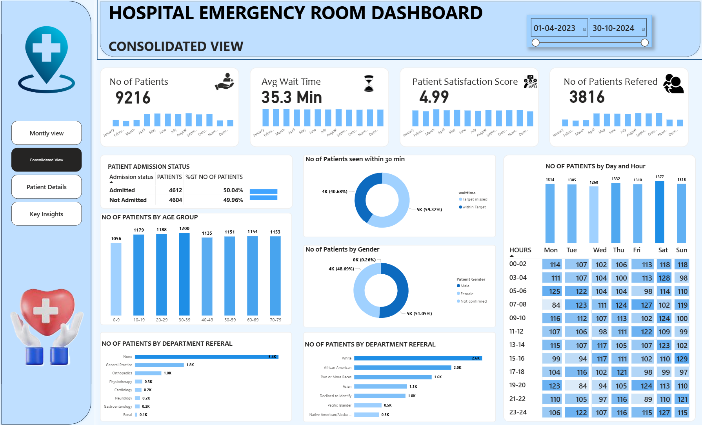
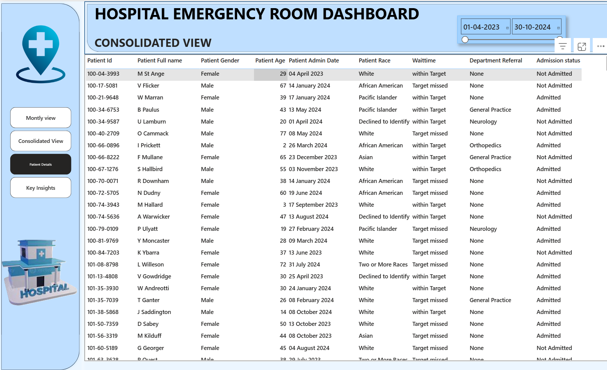
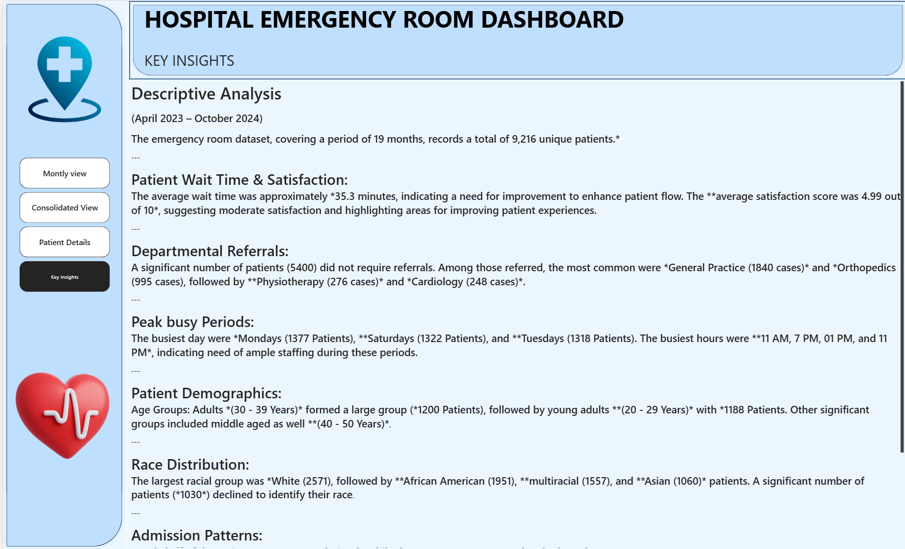

🏥 Hospital Emergency Room Dashboard – Power BI Project

📌 Overview
This project presents an interactive Hospital Emergency Room (ER) Dashboard built using Power BI to monitor, analyze, and optimize ER performance.
It visualizes key operational metrics like patient volume, wait times, satisfaction scores, referrals, demographics, and peak hours.

📊 Goal: Enable hospital administrators to make data-driven decisions for better patient management and improved service quality.

📂 Project Files
HOSPITAL DASHBOARD.pbix → Power BI report file containing all dashboards.

Hospital ER_Data.csv → Dataset used for development.

Hopital Emergency Room PPT.pptx → Project documentation & walkthrough.

/Screenshots → Dashboard images for reference.

🎯 Objectives
Track total patients and their trends.

Monitor average wait time to detect bottlenecks.

Measure patient satisfaction scores.

Analyze referrals to different departments.

Study patient demographics.

Identify peak days & hours for staffing optimization.

📊 Dashboard Previews
1️⃣ Monthly View

2️⃣ Consolidated View

3️⃣ Patient Details

4️⃣ Key Insights

🔄 Project Workflow
Requirement Gathering

Data Walkthrough

Data Connection

Data Cleaning & Quality Check

Data Modeling

Data Processing

DAX Calculations

Dashboard Layout Design

Visual Development & Formatting

Insights Generation

🛠 Tools & Technologies
Power BI Desktop – Dashboard development

CSV/Excel – Data source

DAX – KPI & measure calculations

📈 Key Insights from Analysis
Avg Wait Time: 35.3 mins – needs improvement.

Satisfaction Score: 4.99/10 – moderate service satisfaction.

Peak Days: Monday, Saturday, Tuesday.

Peak Hours: 11 AM, 1 PM, 7 PM, 11 PM.

Major Age Group: 30–39 years.

Top Referrals: General Practice & Orthopedics.

🚀 How to Use
Download the .pbix file.

Open in Power BI Desktop.

Refresh data if needed (update CSV path).

Navigate dashboards via sidebar menu.

📜 Author
Akshay Pitta
📧 pittaakshay045@gmail.com
💼 https://www.linkedin.com/in/pittaakshay045/
